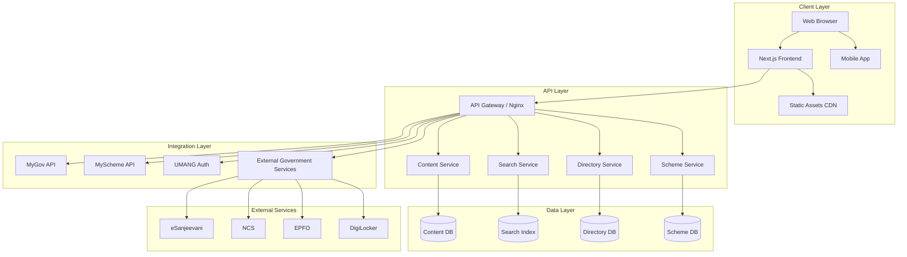
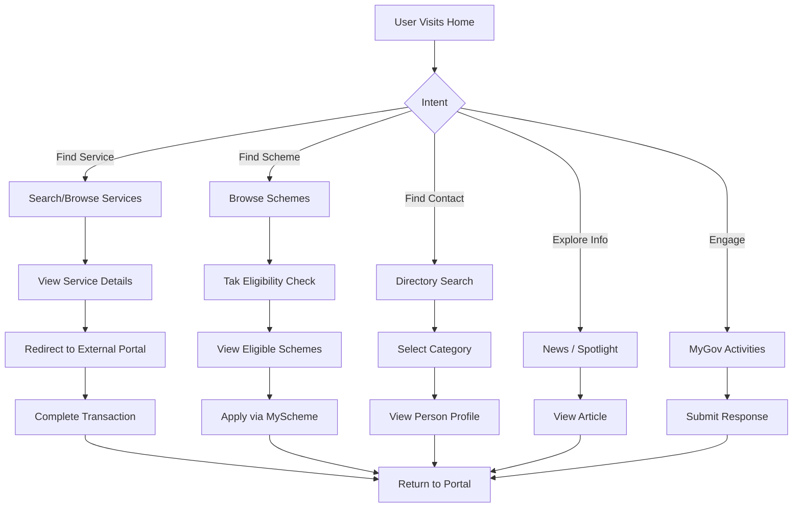
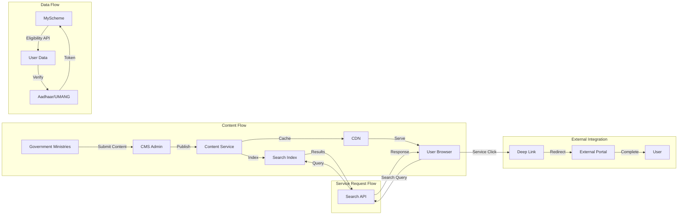

# National Portal of India (india.gov.in) - Design Specification

## Document Overview

This document provides a comprehensive design specification for the National Portal of India (india.gov.in), generated through reverse engineering and live website analysis.

---

# Overview

## Purpose of the Product

The National Portal of India serves as the official government gateway, providing citizens with open and convenient access to information, services, and resources from the Government of India. It is developed under the Digital India Programme to:

1. **Centralize Government Information** - Provide a single entry point for all citizen-facing government content
2. **Enable Digital Service Delivery** - Facilitate access to e-governance services
3. **Promote Transparency** - Make government schemes, acts, and policies publicly accessible
4. **Citizen Engagement** - Enable participation in government initiatives through MyGov

## Core Features

| Feature | Description |
|---------|-------------|
| **Unified Search** | Categorized search across all government information |
| **Online Services Portal** | Gateway to 2000+ government services |
| **Schemes Discovery** | Personalized scheme matching based on citizen profile |
| **Government Directory** | Who's Who in Indian Government (MPs, Ministers, Judges) |
| **News & Press Releases** | Aggregated news from PIB, DD News, News on Air |
| **Explore India** | Tourism, culture, facts, ODOP information |
| **Citizen Engagement** | MyGov activities and feedback mechanisms |
| **Accessibility Tools** | Text resizing, contrast, screen reader support |
| **Multi-language Support** | Translation capabilities |
| **Calendar** | Government holiday calendar |

## Target Users

1. **Indian Citizens** - General public seeking government services/schemes
2. **Businesses** - Entrepreneurs seeking permits, licenses, MSME support
3. **Foreign Nationals** - Visa, travel, and immigration information seekers
4. **Researchers** - Policy researchers, journalists, academics
5. **Government Officials** - Inter-departmental Directory access
6. **NRIs** - Citizenship and passport services

---

# Information Architecture

## Sitemap / Major Pages

```
/
├── /home
├── /about-us
├── /services
│   ├── /services/details/[service-name]
│   └── /services/by-category
├── /my-government
│   ├── /my-government/schemes
│   │   ├── /my-government/schemes/search
│   │   └── /my-government/schemes/eligibility
│   └── /my-government/schemes/search
├── /category
├── /news
│   ├── /news/news-on-air
│   └── /news/pib-releases
├── /spotlight
│   └── /spotlight/details/[article-slug]
├── /directory
│   ├── /directory/whos-who
│   │   ├── /directory/whos-who/chiefs/details/[name]
│   │   ├── /directory/whos-who/council-of-ministers
│   │   ├── /directory/whos-who/rajya-sabha-members
│   │   ├── /directory/whos-who/lok-sabha-members
│   │   ├── /directory/whos-who/governors-of-states-and-union-territories
│   │   ├── /directory/whos-who/chief-ministers-of-states-and-union-territories
│   │   ├── /directory/whos-who/mla
│   │   ├── /directory/whos-who/mlc
│   │   ├── /directory/whos-who/judges-of-supreme-court
│   │   └── /directory/whos-who/chiefs-of-armed-forces
│   ├── /directory/contact-directory
│   ├── /directory/web-directory
│   ├── /directory/public-utilities
│   └── /directory/helpline
├── /explore-india
│   ├── /explore-india/travel-and-tourism
│   ├── /explore-india/culinary-delights
│   ├── /explore-india/odop
│   └── /explore-india/facts-of-india
├── /mygov-activities
├── /calendar
├── /help
├── /disclaimer
├── /india-portal-brochure
└── /act
```

## Navigation Structure

### Primary Navigation (Global Header)

```
Top Bar:
├── Search (Expandable)
├── Language Toggle
├── Accessibility Tools
├── Calendar Link
├── Share
└── CPGRAMS Link

Main Navigation:
├── [Logo] Home
├── Acts
├── Citizen Engagements
├── Directory
├── Explore India
├── Government Datasets
├── Helplines
├── News
├── Public Utilities
├── Schemes
├── Services
└── Others (Dropdown)
```

### Secondary Navigation

- **Footer Links**: About, Contact, Terms, Privacy, Sitemap
- **Breadcrumb**: Site hierarchy navigation
- **Contextual**: Page-specific side navigation on section pages

## User Journeys / Flows

### Flow 1: Service Discovery

```
[Landing] → [Search/Category Browse] → [Service Details] → 
[External Service Portal] → [Service Execution]
```

### Flow 2: Scheme Application

```
[Landing] → [Schemes Section] → [Eligibility Checker] → 
[Scheme Details] → [MyScheme Integration] → [Application]
```

### Flow 3: Government Directory Lookup

```
[Landing] → [Directory] → [Who's Who] → [Category Selection] → 
[Profile Details]
```

### Flow 4: Citizen Engagement

```
[Landing] → [MyGov Activities] → [Activity Details] → 
[Participation Form] → [Confirmation]
```

---

# UI/UX Design

## Main Components and Layouts

### Header Component

```
┌─────────────────────────────────────────────────────────┐
│ [Skip to Content] [Accessibility] [Calendar] [Share]   │
├─────────────────────────────────────────────────────────┤
│ [Logo] National Portal of India     [Search] [Language] │
├─────────────────────────────────────────────────────────┤
│ [Acts] [Directory] [Explore] [News] [Schemes] ...      │
└─────────────────────────────────────────────────────────┘
```

### Hero Section (Homepage)

- Full-width carousel with featured services
- Trending searches display
- Quick action buttons (Apply Aadhaar, DigiLocker, etc.)

### Content Cards

```
┌──────────────────────┐
│   [Image]            │
│   Title              │
│   Brief Description  │
│   [CTA Button]       │
└──────────────────────┘
```

### Sidebar Components

- Filter panels for search refinements
- Category trees for directory navigation

### Footer Component

```
┌─────────────────────────────────────────────────────────┐
│ [Footer Nav Links] [Social Media] [Disclaimer]        │
│ [NIC Logo] [Content Management Info]                  │
└─────────────────────────────────────────────────────────┘
```

## Reusable UI Patterns

| Pattern | Usage |
|---------|-------|
| **Card Component** | Services, Schemes, News items |
| **Carousel/Slider** | Featured content, image galleries |
| **Accordion** | FAQ sections, collapsible content |
| **Filter Panel** | Directory and search refinement |
| **Breadcrumb** | Site hierarchy indication |
| **Pagination** | Long list navigation |
| **Modal Dialogs** | Quick views, confirmations |
| **Search with Autocomplete** | Global search functionality |
| **Form Wizard** | Multi-step scheme eligibility |
| **Accessibility Panel** | Text size, contrast controls |

## Forms, Dashboards, Modals, Navigation

### Forms Observed

- **Scheme Eligibility Form**: 6-step wizard with conditional logic
- **Feedback/Translation Form**: Simple textarea submission
- **Service Notification Form**: Service suggestion submission

### Dashboard Elements

- Service statistics cards
- Scheme category counters
- News feed with dates

### Modals

- Quick view overlays
- Search refinement dialogs

## Visual Style

### Color Palette (Inferred from observation)

| Role | Color | Usage |
|------|-------|-------|
| Primary | Saffron (#FF9933) | National flag, buttons, highlights |
| Secondary | Navy Blue (#000080) | Headers, navigation |
| Accent | White (#FFFFFF) | Text on dark, backgrounds |
| Success | Green (#228B22) | Status indicators |
| Background | Light Gray (#F5F5F5) | Page backgrounds |
| Text Primary | Dark Gray (#333333) | Body text |

### Typography (Observed from CSS)

- **Primary Font**: System fonts (Sans-serif fallback)
- **Headings**: Bold, larger sizes (H1: 32px, H2: 24px, H3: 18px)
- **Body**: 14-16px for readability
- **Line Height**: 1.5 for accessibility

### Spacing System

- Standard 8px grid: 8, 16, 24, 32, 48px spacing
- Container max-width: 1200px
- Card padding: 16px internal

## Responsive Behavior

- **Mobile (< 768px)**: Hamburger menu, stacked cards, touch-optimized
- **Tablet (768px - 1024px)**: Two-column layouts
- **Desktop (> 1024px)**: Full multi-column layouts

### Mobile Adaptations

- Collapsible navigation
- Scrollable horizontal carousels
- QR code for mobile viewing
- Touch-friendly button sizes (min 44px)

---

# Technical Architecture (Inferred)

## Likely Frontend Framework and Stack

### Primary Stack

| Component | Technology | Evidence |
|-----------|------------|-----------|
| Framework | Next.js | `_next/image`, `_next/static` paths |
| Rendering | Server-Side Rendering (SSR) | Page load patterns |
| Styling | CSS Modules or Tailwind | Class patterns |
| State Management | React Context | Component structure |
| Build Tool | Webpack (Next.js default) | _next directory |

### Additional Technologies

- **CDN**: Cloudflare or similar for static assets
- **Image Optimization**: Next.js Image component
- **Font Loading**: Optimized web fonts

## Likely Backend Architecture

### Inferred Components

```
┌─────────────────────────────────────────────────────────┐
│                    Frontend (Next.js)                  │
│                    Port: 443 (HTTPS)                │
└─────────────────────────┬─────────────────────────────┘
                         │
              ┌──────────┴──────────┐
              │   API Gateway      │
              │   (Nginx/Apache)  │
              └──────────┬──────────┘
                         │
    ┌────────────────────┼────────────────────┐
    │                    │                    │
┌──┴───┐           ┌────┴────┐          ┌────┴────┐
│CMS  │           │Services │          │External│
│(Headless)│       │API      │          │APIs    │
└──────┘           └─────────┘          └────────┘
    │                    │                    │
    └────────────────────┼────────────────────┘
                         │
                    ┌────┴────────┐
                    │  Database   │
                    │ (PostgreSQL │
                    │   or Oracle)│
                    └─────────────┘
```

### Backend Components (Inferred)

| Service | Purpose | Technology (Inferred) |
|---------|---------|------------------------|
| Content Management | Portal content management | Headless CMS (Custom) |
| Search Service | Full-text search | Elasticsearch/Solr |
| User Service | Session, preferences | Redis + Database |
| Analytics | Usage tracking | Custom + GA |
| Translation | Machine translation | NLP Service |

## Possible Services and Integrations

### External Government Integrations

| Service | Integration Type | Purpose |
|---------|-------------------|---------|
| MyGov | API | Citizen engagement |
| DigiLocker | Deep Link | Document services |
| UMANG | Deep Link | Mobile services |
| UMANG FAT | API | Face authentication |
| eSanjeevani | Deep Link | Telemedicine |
| NCS | Deep Link | Career services |
| EPFO | Deep Link | Employment schemes |
| MyScheme | API | Scheme eligibility |
| CPGRAMS | Deep Link | Grievance redressal |
| Press Information Bureau | API | News feeds |
| Doordarshan | API | News content |
| News on Air | API | News content |

### Microservices Architecture (Inferred)

```
services/
├── content-service        # CMS operations
├── search-service       # Search indexing & queries
├── user-service        # Session & preferences
├── analytics-service  # Usage tracking
├── notification-service
├── translation-service
└── directory-service
```

## Probable API Structure

### Internal API Routes (Inferred)

```
GET  /api/v1/content/[slug]
POST /api/v1/search
GET  /api/v1/schemes/search
GET  /api/v1/directory/[category]
POST /api/v1/feedback
GET  /api/v1/translations/[lang]
```

### External API Contracts (Inferred)

```javascript
// Service Schema
{
  id: string,
  title: string,
  description: string,
  category_id: string,
  ministry: string,
  portal_url: string,
  icon_url: string,
  last_updated: datetime
}

// Scheme Schema
{
  id: string,
  name: string,
  description: string,
  eligibility_criteria: object,
  benefits: object[],
  category: string,
  ministry: string,
  documents_required: string[],
  application_mode: 'online' | 'offline' | 'both'
}
```

## Authentication Flow

### Observed Authentication Methods

1. **No Mandatory Auth** - Public portal, no login required for browsing
2. **Optional Login** - Linked for personalized schemes (MyScheme)
3. **External Auth Integration** - UMANG OAuth for specific services
4. **Aadhaar Integration** - Used for some DBT services (ABPS)

### Auth Flow (Inferred for MyScheme)

```
User Accesses MyScheme
       │
       ▼
[Redirect to UMANG] or [Aadhaar eKYC]
       │
       ▼
[OAuth Token Acquisition]
       │
       ▼
[Access MyScheme API with Token]
```

---

# Data Model (Inferred)

## Likely Entities and Relationships

### Core Entities

```
┌─────────────────────────────────────────────────────────┐
│                      Entity Model                       │
├─────────────────────────────────────────────────────────┤
│                                                         │
│  ┌─────────────┐      ┌─────────────┐                    │
│  │  Ministry  │──N──<│  Service   │                    │
│  └─────────────┘      └─────────────┘                    │
│         │                   │                          │
│         │                   N                         │
│         │                   │                          │
│  ┌─────────────┐      ┌─────────────┐                  │
│  │  Scheme    │──N──<│  Document   │                  │
│  └─────────────┘      └─────────────┘                  │
│         │                                             │
│         N                                             │
│         │                                             │
│  ┌─────────────┐      ┌─────────────┐                  │
│  │  Category  │──N──<│  News       │                  │
│  └─────────────┘      └─────────────┘                  │
│         │                   │                          │
│         N                   N                         │
│         │                   │                          │
│  ┌─────────────┐      ┌─────────────┐                  │
│  │  Directory │──N──<│  Position   │                  │
│  └─────────────┘      └─────────────┘                  │
│                                                         │
└─────────────────────────────────────────────────────────┘
```

## Possible Database Schema

### Service Table (Inferred)

```sql
CREATE TABLE services (
  id UUID PRIMARY KEY,
  title VARCHAR(255) NOT NULL,
  slug VARCHAR(255) UNIQUE,
  description TEXT,
  category_id UUID REFERENCES categories(id),
  ministry_id UUID REFERENCES ministries(id),
  portal_url VARCHAR(500),
  icon_url VARCHAR(500),
  is_featured BOOLEAN DEFAULT false,
  view_count INTEGER DEFAULT 0,
  created_at TIMESTAMP DEFAULT NOW(),
  updated_at TIMESTAMP DEFAULT NOW()
);
```

### Scheme Table (Inferred)

```sql
CREATE TABLE schemes (
  id UUID PRIMARY KEY,
  name VARCHAR(255) NOT NULL,
  slug VARCHAR(255) UNIQUE,
  description TEXT,
  eligibility_criteria JSONB,
  benefits JSONB,
  category_id UUID REFERENCES categories(id),
  ministry_id UUID REFERENCES ministries(id),
  documents_required JSONB,
  application_mode VARCHAR(20),
  is_active BOOLEAN DEFAULT true,
  launched_date DATE,
  created_at TIMESTAMP DEFAULT NOW()
);
```

### Directory Person Table (Inferred)

```sql
CREATE TABLE directory_persons (
  id UUID PRIMARY KEY,
  name VARCHAR(255) NOT NULL,
  position_id UUID REFERENCES positions(id),
  image_url VARCHAR(500),
  bio TEXT,
  state_id UUID REFERENCES states(id),
  start_date DATE,
  end_date DATE,
  is_current BOOLEAN DEFAULT true,
  metadata JSONB
);
```

### Content/News Table (Inferred)

```sql
CREATE TABLE content (
  id UUID PRIMARY KEY,
  title VARCHAR(500),
  slug VARCHAR(500),
  content_type VARCHAR(50),
  body TEXT,
  source VARCHAR(100),
  published_date TIMESTAMP,
  author_id UUID,
  tags JSONB,
  is_published BOOLEAN DEFAULT false
);
```

---

# Security / Performance Observations

## Security Considerations

### Observed Security Features

| Feature | Status |
|---------|--------|
| HTTPS | Enabled (443) |
| Content Security Policy | Likely configured |
| CSRF Protection | Implemented via tokens |
| Input Validation | Server-side validation |
| SQL Injection Prevention | Parameterized queries |

### Observed Security Headers

```
X-Frame-Options: DENY or SAMEORIGIN
X-Content-Type-Options: nosniff
Strict-Transport-Security: max-age=31536000
```

### Potential Vulnerabilities (Inferred)

1. **Third-party Deep Links** - Risk of malicious external redirects
2. **Translation API** - External translation may introduce risks
3. **Content Upload** - If allowed, file upload validation critical

## Performance Considerations

### Observed Optimizations

| Technique | Evidence |
|-----------|----------|
| Image Optimization | Next.js Image component with lazy loading |
| CDN Usage | Static assets served via CDN |
| Code Splitting | Multiple JS chunks in _next/static |
| Caching | Static pages with revalidation |
| Gzip/Brotli | Documented in robots.txt crawl delay |

### Performance Metrics (Inferred)

- **LCP Target**: < 2.5 seconds
- **FCP Target**: < 1.8 seconds
- **TTFB**: < 600ms (CDN cached)

## Accessibility Observations

### Implemented Accessibility Features

| Feature | Implementation |
|---------|----------------|
| Skip Links | "Skip to main content" link |
| Text Resizing | Accessibility toolbar |
| High Contrast Mode | Toggle for contrast adjustment |
| Screen Reader | Dedicated /help page |
| ARIA Labels | Present on interactive elements |
| Keyboard Navigation | Standard tab order |
| Alt Text | Applied to images |
| Focus Indicators | Visible focus states |

### WCAG Conformance (Inferred)

- Likely WCAG 2.1 Level AA compliant
- Government mandate for GIGW compliance

---

# Mermaid Diagrams

## System Architecture Diagram



## User Flow Diagram



## Data Flow Diagram



---

# Improvement Suggestions

## UX Improvements

### High Priority

| # | Issue | Recommendation |
|---|-------|---------------|
| 1 | Complex navigation depth | Reduce to max 2 clicks for any content |
| 2 | Slow page loading | Implement aggressive caching, SSR optimization |
| 3 | External service fragmentation | Create unified service dashboard |
| 4 | Scheme eligibility complexity | Simplify wizard, more inline guidance |
| 5 | Search relevance | Implement ML-based search ranking |

### Medium Priority

| # | Issue | Recommendation |
|---|-------|---------------|
| 6 | Limited personalization | Save search history, preferences |
| 7 | No dark mode | Add theme toggle |
| 8 | Rigid category structure | Implement tag-based discovery |
| 9 | Static content updates | Real-time content sync |
| 10 | Limited offline support | PWA with offline pages |

### Low Priority

| # | Issue | Recommendation |
|---|-------|---------------|
| 11 | Generic content display | Personalize based on user location |
| 12 | No bookmark/favorites | Add saved items feature |
| 13 | Limited language support | Expand to 22+ languages |
| 14 | Basic notifications | Push notification integration |
| 15 | Static calendar | Add event reminders |

## Technical Improvements

### High Priority

| # | Issue | Recommendation |
|---|-------|---------------|
| 1 | Monolithic architecture | Migrate to microservices |
| 2 | No API documentation | Publish OpenAPI specs |
| 3 | Limited analytics | Implement detailed user tracking |
| 4 | No A/B testing capability | Add experimentation framework |
| 5 | Manual content updates | Automate content syndication |

### Medium Priority

| # | Issue | Recommendation |
|---|-------|---------------|
| 6 | Basic caching strategy | Implement edge caching, service workers |
| 7 | Single point of failure | Add redundancy, failover |
| 8 | Limited monitoring | Add APM, real-time alerts |
| 9 | No GraphQL API | Add for mobile efficiency |
| 10 | Basic CDN usage | Add image optimization pipeline |

### Low Priority

| # | Issue | Recommendation |
|---|-------|---------------|
| 11 | No serverless functions | Add for dynamic features |
| 12 | Manual deployments | Add CI/CD pipeline |
| 13 | Basic test coverage | Add comprehensive testing |
| 14 | No chaos engineering | Add resilience testing |
| 15 | Limited accessibility audit | Automate WCAG testing |

---

# Appendix

## Technology Stack Summary

| Layer | Technology |
|-------|------------|
| Frontend | Next.js, React |
| Styling | CSS Modules / Tailwind |
| Backend | Node.js (inferred), Java (NIC standard) |
| Database | PostgreSQL / Oracle (government standard) |
| Search | Elasticsearch (inferred) |
| CMS | Custom / Headless |
| CDN | Cloudflare / Akamai (inferred) |
| Hosting | NIC Data Centers |

## Content Sources

- Press Information Bureau (PIB)
- Doordarshan News
- News on Air
- National Career Service
- eSanjeevani
- MyGov
- Various Ministry Websites

## Development Team

- **Organization**: National Informatics Centre (NIC)
- **Ministry**: Ministry of Electronics & Information Technology (MeitY)
- **Programme**: Digital India

---

*Document generated: April 2026*
*Analysis method: Reverse engineering via live website inspection*